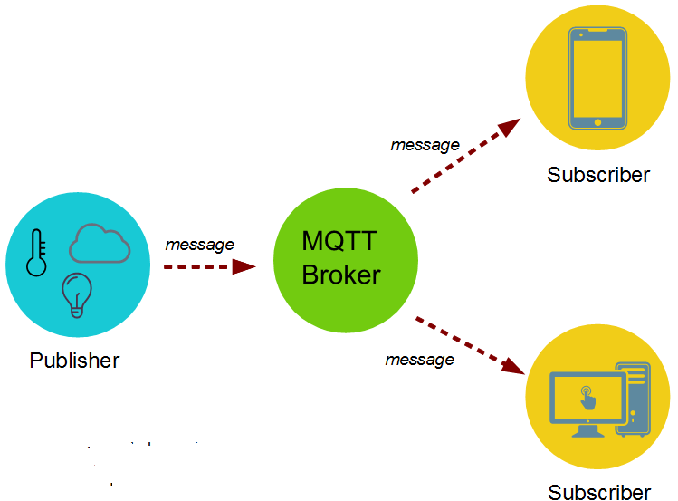

<!--  -->


* MQTT ---> Message Queuing Telemetry Transport

* it is a client library for MQTT protocol `written in JavaScript` for node.js and the browser

* MQTT is a lightweight client-server publish/subscribe messaging protocol

* MQTT is used for data exchange between devices and server applications


## installation
```
npm install mqtt --save
```


## component

1. Publisher 
2. broker     --- inside broker there are some queues
3. subscriber 

<!--  -->


## methods

1. connect
```
client.on('connect', function (connack) {
   console.log('Connected')
})
```

2. reconnect
```
client.on('reconnect', function () {
  console.log('Reconnecting...')
})
```

3. close
```
client.on('close', function () {
  console.log('Disconnected')
})
```

4. disconnect
```
client.on('disconnect', function (packet) {
   console.log(packet)
})
```

5. publish
```
Client.publish(topic, message, [options], [callback]
                🔽
client.publish('topic', 'Hello world')
                🔽
client.publish('testtopic', 'Hello, function () {
    console.log('Published')
})
```

6. subscribe
```
client.subscribe('test', function (err) {
    console.log(error)
})
```

7. error
```
client.on('error', function (error) {
  console.log(error)
})
```

8. message
```
client.on('message', function (topic, payload, packet) {
  console.log(`Topic: ${topic}, Message: ${payload.toString()}, QoS: ${packet.qos}`)
})
```
